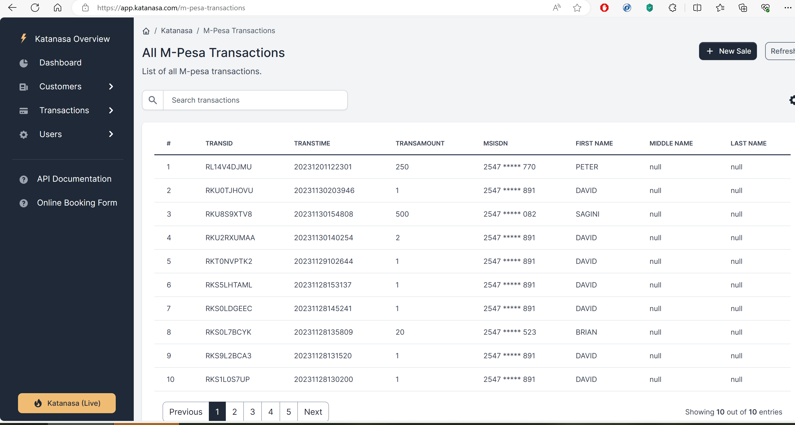
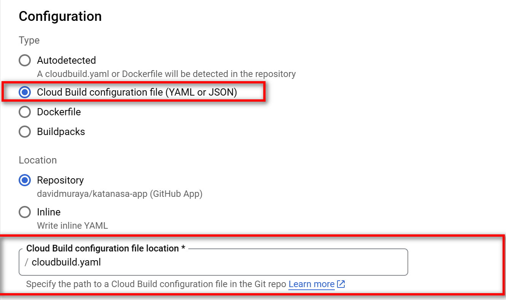
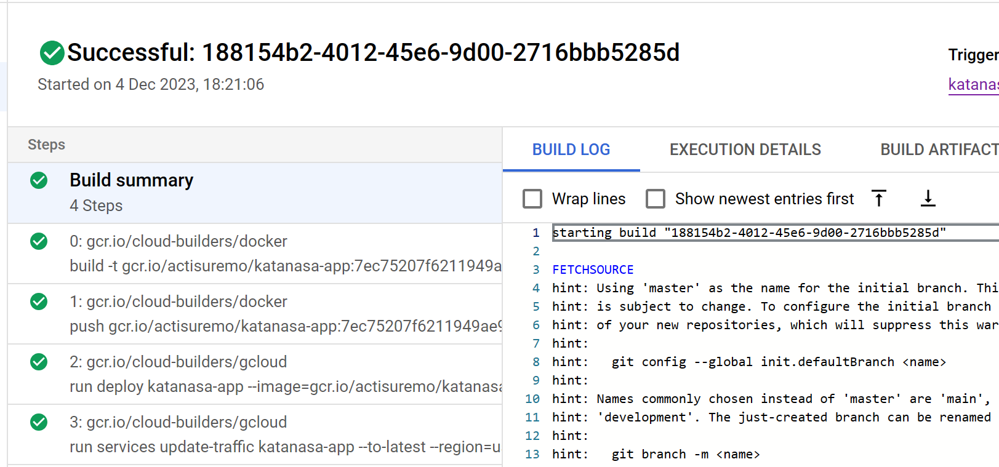

# Katanasa App

## Built on the FastAPI Python Framework.

This is an application to monitor client payments and how much is unearned. 
It has been built using FastAPI library and has integration with Safaricom MPESA daraja API. 

FastAPI is a modern, fast (high-performance) web framework for building APIs with Python 3.7+ based on standard Python type hints.

For the M-Pesa client, this library uses the python asynchronous client called aiohttp. 
aiohttp is a versatile asynchronous HTTP client/server framework for Python that supports both client and server-side applications.

MPESA Daraja API documentation can be found at https://developer.safaricom.co.ke

The technology stack used to create the backend of this application is as follows:

- **Framework**
    - FastAPI and Starlette
- **ASGI Server**
    - Uvicorn and Gunicorn
- **Containerization**
    - Docker
- **Database**
    - Firestore
- **Authentication**
    - Bcrypt
    - Passlib
    - JWT Tokens with Pyjwt
- **Testing**
    - Pytest
- **Development**
    - PyCharm

# The Web Application

## M-pesa Transactions:
To view incoming payments, click on Transactions > M-pesa transactions:


## Configuration
Please create a .env file in the app folder with your configuration:
```shell
# M-Pesa Settings:
C2B_CONSUMER_KEY="xxx"
C2B_CONSUMER_SECRET="xxx"
LIPA_NA_MPESA_CONSUMER_KEY="xx"
LIPA_NA_MPESA_CONSUMER_SECRET="xxx"
LIPA_NA_MPESA_PASSKEY="xxx"
C2B_CONFIRMATION_URL=""
C2B_VALIDATION_URL=""
LIPA_NA_MPESA_CALLBACK_URL="xxxx"
LIPA_NA_MPESA_BUSINESS_SHORT_CODE="xxx"
```

### Katanasa Project
Project structure:
```

├── Dockerfile
├── requirements.txt
├── README.md
├── app
    ├── main.py
    ├── __init__.py
    ├── backend
        ├── __init__.py
        ├── authentication
        ├── customer
        ├── database
        ├── system
        ├── transactions
        ├── http_utils
        ├── user
 
    ├── frontend
        ├── __init__.py
        ├── static
        ├── swagger
        ├── templates
            ├── login.html
        ├── templates_controllers
            ├── page_index.py
 
├── tests
    ├── test_main.py
    ├── __init__.py

```

[_Dockerfile_](Dockerfile)
```

FROM python:3.9-slim-buster

WORKDIR /katanasa-app

# Step 1: Copy requirements file to the working directory.
COPY ./requirements.txt /katanasa-app/requirements.txt

# Step 2: Install requirements from requirements.txt.
RUN pip install --no-cache-dir --upgrade -r /katanasa-app/requirements.txt

# Step 3: copy from app to /katanasa-app/app.
COPY ./app /katanasa-app/app

# Step 4: Run the web service on container startup using gunicorn webserver.
CMD exec gunicorn --bind :$PORT --workers 1 --worker-class uvicorn.workers.UvicornWorker  --threads 8 app.main:app


# Debugging on localhost:
# EXPOSE 8080

# CMD ["uvicorn", "app.main:app", "--host", "0.0.0.0", "--port", "8080"]
```

## Continuous Build Google Cloud Run

#### To manually build an image container:
1. Install Google Cloud SDK.
2. Run:
```
gcloud builds submit --tag gcr.io/{MY-PROJECT-ID}/katanasa-app
```
#### Automated container image build:
Committing code to the master branch will automatically trigger a cloud build. 
In cloud run, select the latest container from the Container Registry and deploy.

### Accessing the application
In Cloud Run, after the application starts, navigate the site generated by Google cloud in your web browser, and you should see the app.

## Debugging on Localhost with Docker Desktop
On the dockerfile, change Step 4 and make the following comment active:
```

# Step 4: Run the web service on container startup using gunicorn webserver.
# CMD exec gunicorn --bind :$PORT --workers 1 --worker-class uvicorn.workers.UvicornWorker  --threads 8 app.main:app


# Debugging on localhost:
EXPOSE 8080

CMD ["uvicorn", "app.main:app", "--host", "0.0.0.0", "--port", "8080"]

```

Build the container with the following command:
```
docker build -t katanasa-app:latest .
```

## Continuous Deployment on Cloud Run

Use the [cloudbuild.yaml](cloudbuild.yaml) file to create your deployment pipeline on GCP.

In the gclould build trigger configuration page, set the build trigger as follows:



Successful build and deployment:

